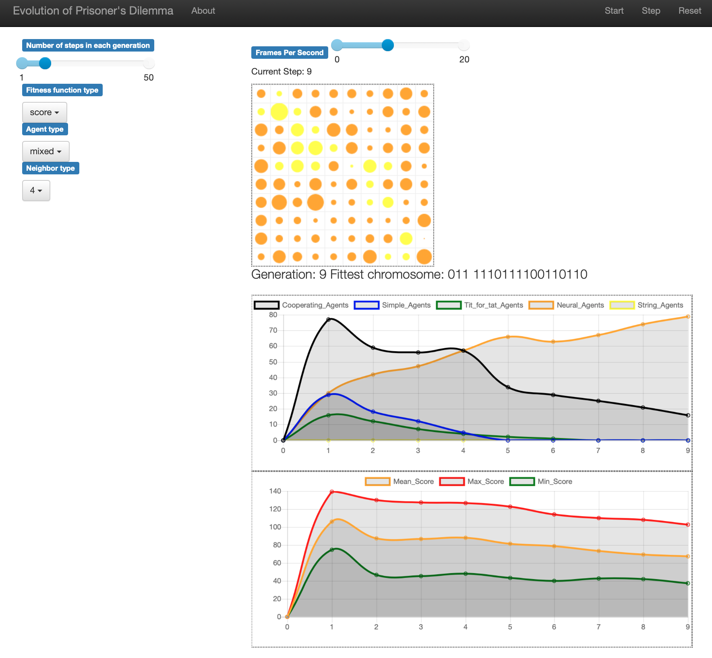

# Moraliser

Implementation for **Evolution of Strategies for Cooperation**

## Dependencies

You will need a **python3 (>= 3.8) environment** to run the code. Before you start, please run this command to install the dependencies:

```commandline
pip3 install -r ./requirements.txt
```

## How to run the demo

We made a Web application to give you a quick impression of our project. **In the `moraliser` directory**, run:

```commandline
python3 -m app.server
```

You will see a grid where nodes with different colors are randomly placed, which indicates agents of different types. Click on the Start button on the top left and here we go!

If everything works, you should see the nodes on the grid are changing their colors. Orange and yellow agents gradually take over, which means our Neural-Agents and String-Agents win over the tournaments of Iterated Prisoner's Dilemma.

Below the grid are some plots of how agents' statistical attributes evolve over generations.

Check the settable parameters on the left-hand side, **click Reset button** on the top left, and replay the model for fun!



Besides what you see in the browser, most parameters and settings are in the `lib/config.py` file with detailed explanations. Please have a look, try with different configurations to explore interesting results!

In `app/server.py`, you can uncomment line 30 or 31 to override the initial layout of agent types with two predefined maps. You can also define a `agent_type_map` straightforward on your own!

## Build your own application

You can also run our `PDModel` instance in a separated python file, since running code without GUI is way more efficient and suitable for data analysis.

Please refer to `run.py`, `plot.py`, and `load.py` for an example which studies how 100 NeuralAgents evolve through time. To run it, simply execute:
```commandline
python3 run.py
```

Have fun IPD!
